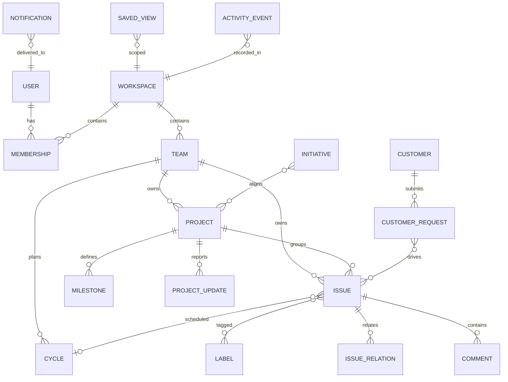

# Domain Model and Dependencies

## 1. Core Entity Groups

### Identity and Organization

- `User`
- `Workspace`
- `Team`
- `Membership`
- `Role`

### Work Management

- `Issue`
- `IssueStatus`
- `IssueRelation`
- `Label`
- `Cycle`
- `Attachment`

### Planning

- `Project`
- `ProjectStatus`
- `Milestone`
- `ProjectUpdate`
- `Initiative`

### Knowledge and Collaboration

- `Document`
- `Comment`
- `Reaction`
- `ActivityEvent`
- `Subscription`
- `Notification`

### Product Feedback

- `Customer`
- `CustomerRequest`

### Platform

- `SavedView`
- `NotificationPreference`
- `Integration`
- `Webhook`
- `ApiKey`
- `AutomationRule`
- `AgentThread`
- `AgentMessage`
- `AgentRun`

## 2. Primary Relationships



## 3. Architectural Dependency Direction

```text
UI surfaces
  -> application use cases
    -> domain services
      -> repositories and event bus
        -> database, search, realtime, object storage, integrations
```

Rules:

- UI modules do not query the database directly.
- Issue, Project, and Initiative mutations emit domain events.
- Notifications, activity, search indexing, Pulse, and integrations consume
  those events instead of being embedded into mutation handlers.
- Authorization is checked at both use-case and query boundaries.
- Saved views persist structured queries, not implementation-specific SQL.
- Realtime messages describe invalidation or domain changes; they are not the
  sole source of truth.

## 4. Important Domain Events

- `workspace.member_added`
- `team.member_joined`
- `issue.created`
- `issue.updated`
- `issue.status_changed`
- `issue.assigned`
- `issue.commented`
- `issue.mentioned`
- `project.created`
- `project.updated`
- `project.health_changed`
- `project.update_published`
- `initiative.updated`
- `cycle.started`
- `cycle.completed`
- `customer_request.created`
- `document.updated`
- `agent.run_completed`

Consumers may include:

- Activity timeline writer
- Notification service
- Search indexer
- Pulse feed builder
- Analytics rollup worker
- Integration and webhook dispatcher

## 5. Suggested Package Boundaries

The final framework can change, but the logical package boundaries should
remain stable:

```text
apps/
  web/
  api/
packages/
  ui/
  design-tokens/
  domain/
  auth/
  query-engine/
  rich-text/
  realtime/
  integrations/
  testing/
```

Do not scaffold these packages until the frontend, API, database, and hosting
stack have been selected.

## 6. Implemented Issue Aggregate

The current Go aggregate intentionally uses Flow's public entity vocabulary:

- `Issue` owns persisted status, priority, assignee, labels, project, due date,
  parent ID, subscriber IDs, attachments, and relation projections.
- Flow Issue descriptions are backed by a related `DocumentContent` model.
  Its source of truth is a serialized Yjs update (`contentState`); ProseMirror
  JSON (`descriptionData`/runtime `contentData`) and Markdown (`description`)
  are input/projection formats. The current local `descriptionState` field is a
  transition layer until this aggregate is implemented. Flow's live editor
  also demonstrates stable block IDs and author attribution; those node
  attributes belong in the document schema, not persisted DOM HTML.
  Live edits use a workspace-authenticated WebSocket room per
  `DocumentContent`. Yjs updates are appended idempotently before broadcast,
  Awareness carries ephemeral cursors and selections, and versioned snapshots
  compact only the update IDs explicitly included by the saving client. Redis
  Pub/Sub forwards the same document events between API instances.
- `IssueRelation` supports `related`, `blocks`, `blocked_by`, `duplicate`,
  `parent_of`, and `sub_issue_of`. The API writes the inverse projection on the
  related issue in the same transaction.
- Parent updates maintain both `parentId` and the parent's `subIssueIds` index.
- `Comment` and `ActivityEvent` are issue-scoped collaboration records.
- `Attachment` stores metadata in SQLite and file bytes under the configured
  upload directory.

`SQLiteStore.Mutate` serializes aggregate mutation, workspace snapshot write,
and append-only `DomainEvent` insert in one transaction. Create operations use
`MutateWithAggregate` so the event receives the allocated Issue ID rather than
a placeholder.

Implemented HTTP surface:

```text
GET    /api/bootstrap
GET    /api/issues?q=&teamId=&stateId=&projectId=&archived=&filter=&cursor=&limit=&sort=&direction=
POST   /api/issues
PATCH  /api/issues/{id}
DELETE /api/issues/{id}
POST   /api/issues/batch
POST   /api/issues/{id}/comments
POST   /api/issues/{id}/relations
DELETE /api/issues/{id}/relations/{relationId}
POST   /api/issues/{id}/attachments
DELETE /api/issues/{id}/attachments/{attachmentId}
GET    /api/events
```

`GET /api/issues` returns a cursor page (`items`, `nextCursor`, `hasMore`,
`total`). The optional `filter` parameter is a JSON expression tree: use
`{"and":[...]}` or `{"or":[...]}` groups containing `{field, operator,
values}` leaves. Supported operators include `is`, `isNot`, `in`, `notIn`,
`contains`, `doesNotContain`, `within`, `before`, `after`, `between`,
`isEmpty`, and `isNotEmpty`. Cursors are opaque to clients and should be sent
back unchanged when loading the next page.

The Detail Pane and full detail view share a selected Issue ID. Both derive the
current aggregate from the bootstrap store; neither keeps an independent Issue
copy. Ordinary fields are optimistic, field-level patches over the workspace
event stream. Rich-text edits are merged continuously with Yjs and periodically
persisted as a guarded `DocumentContent` snapshot.

See [`flow-prosemirror.md`](flow-prosemirror.md) for the real-application
probe and exact evidence behind this contract.
